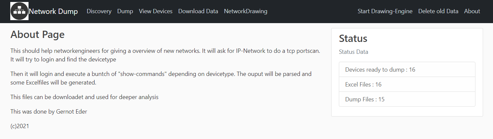
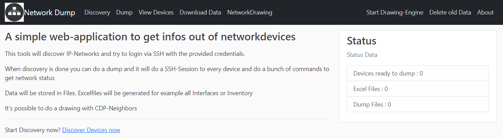
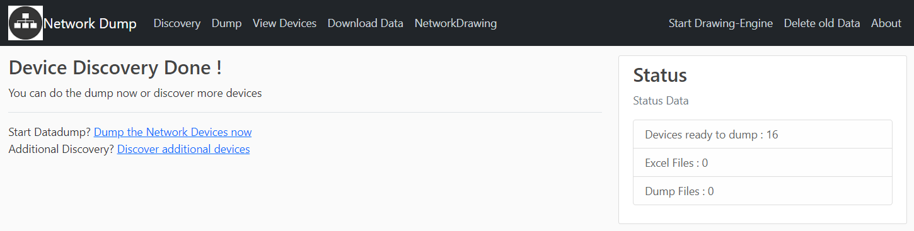
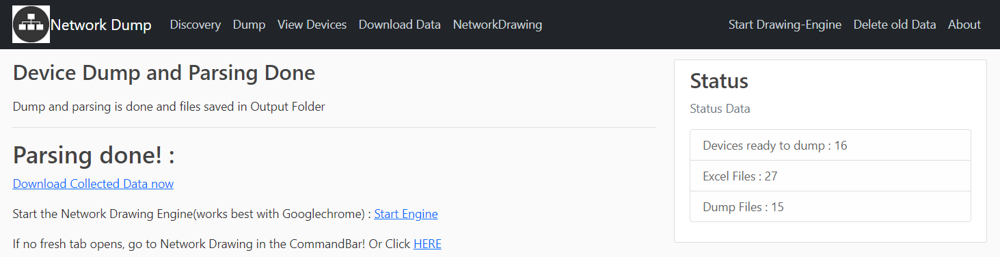
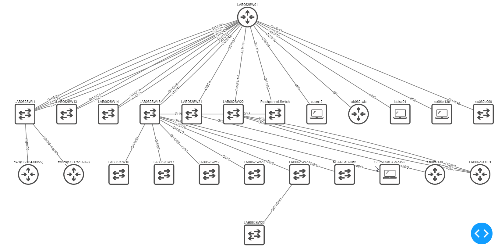

# WebNetworkDump   ---   Allready depricated
# Please checkout : https://github.com/edergernot/WebNetworkgraph and https://github.com/edergernot/WebNetworkDump1.1 which will do basicly the same.


This should help networkengineers for giving an overview of new networks. It will ask for IP-Network to do a tcp portscan. It will try to login via SSH and find the devicetype.

Then it will login and execute a buntch of "show-commands" depending on devicetype. The ouput will be parsed and some Excelfiles will be generated. Commands which will be executed can be modified in "get_dumps.py" file. 

This dump files and parsed files can be downloaded and used for deeper analysis.

I tested with Cisco IOS, IOS-XE, NX-OS and Paloalto Firewalls.
## Easystart with DockerContainer on local maschine!

- Clone Git-Repo:
  - ```git clone https://github.com/edergernot/webnetworkdump```

- Jump into that directory:
  - ```cd webnetworkdump```
- Build Container:
  - ```docker-compose build```

- Start Container:
  - ```docker-compose up```

- Start dumping the Network and browse to:
  - ```http://localhost:5000```

Just add devicecredentials to SSH into device and discovery-network.
Follow the links, Discovery, Dump, then download the result as zip-file or build the Graph based on CDP-Data.

## Sceenshots:
These screenshots are done in our lab with Cisco IOS and IOS-XE Devices.


About page


Start screen


Discoyery screen


Discovery gone, start parsing


Parsing done


Sample graph showing CDP-Neighbors.
You can move the location of the devices so that's make sense for you. 


Thanks to Cisco CodeExchange.
[](https://developer.cisco.com/codeexchange/github/repo/edergernot/webnetworkdump)
